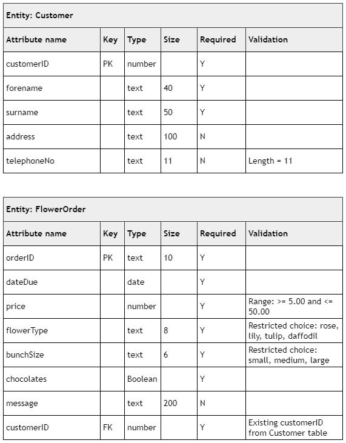

# N5 CS 2020 Task 1B

## Data dictionary

## Tasks

___1c (i)___ A customer would like to change their order from ‘rose’ to ‘tulip’. The price of the order will change from £34 to £17. The orderID is CHQ3848.

Implement __one__ SQL statement that will make the required changes to the order. (__4 marks__)

Print evidence of the SQL statement and the FlowerOrder table, clearly showing that the changes have been implemented.

___1c (ii)___ A new customer provides their name and telephone number.

Implement an SQL statement that will add their details to the database.

* Name: Richard Glass
* Telephone number: 07654029336
* Assign them customerID — 2986.

(__2 marks__)

Print evidence of the SQL statement and the Customer table, clearly showing that the changes have been implemented.